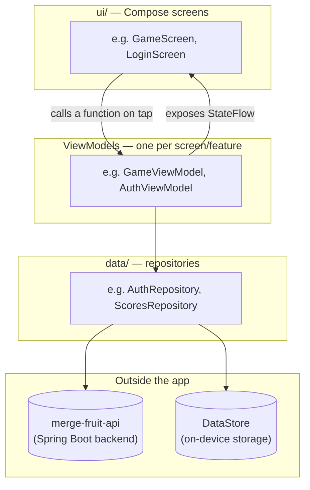

# Architecture

## Folder layout

Everything lives under
[`app/src/main/java/com/a1exymoroz/mergefruit/`](../app/src/main/java/com/a1exymoroz/mergefruit/).
Package names double as folder paths in Kotlin/Java, so this is also the
Java package namespace.

```
mergefruit/
├── MainActivity.kt          the app's single entry point
├── MergeFruitApp.kt         Compose root (theme + navigation)
├── MergeFruitApplication.kt runs once at process start, builds the DI container
│
├── data/                    "backend-facing" code — no UI here
│   ├── api/                 Retrofit interfaces + DTOs + the cold-start pinger
│   ├── auth/                stored-login persistence + the auth repository
│   └── scores/               leaderboard repository
│
├── game/                    the game itself — no networking, no UI framework
│   ├── GameConstants.kt     fruit sizes/points, container dimensions
│   ├── PhysicsEngine.kt     wraps dyn4j: bodies, gravity, merge detection
│   ├── FruitBody.kt         plain data shapes passed out of the physics engine
│   └── GameViewModel.kt     the frame loop, score, next-fruit, game-over
│
├── ui/                      Compose screens, one subfolder per feature
│   ├── theme/                colors + Material theme
│   ├── fruit/                 how a fruit is actually drawn (Canvas)
│   ├── game/                   the game screen + game-over dialog
│   ├── auth/                   login/signup/verify/guest-gate screens
│   ├── leaderboard/             the leaderboard list + its ViewModel
│   └── common/                  small reusable bits (language switcher, etc.)
│
├── nav/NavGraph.kt          which screen shows for which route, and the
│                             "is the user logged in / verified / guest?" gate
│
└── di/                      the app's tiny manual dependency-injection setup
    ├── AppContainer.kt       builds every repository/API client once
    └── ViewModelFactory.kt   lets a screen ask for "the AuthViewModel" etc.
```

If you've used a typical React project with a `services/`, `store/`,
`components/`, `hooks/` split, this maps almost 1:1: `data/` ≈
`services/` + the auth `Context`, `game/` ≈ the physics `hooks/`, `ui/` ≈
`components/`, `nav/` ≈ your React Router setup in `App.tsx`.

## The three layers

This app follows a standard "three-layer" Android structure. Data flows
downward on user actions, and flows back upward as observable state:



- **`ui/`** — Compose functions. Pure rendering: given some state, draw it.
  A screen never calls Retrofit or reads a file directly.
- **ViewModels** — one per screen (or shared where it makes sense, like
  `AuthViewModel`). Holds UI state as a `StateFlow` (≈ a Redux store slice,
  or a `useState` that survives screen rotation/navigation). Screens
  `collectAsStateWithLifecycle()` it, which is the Compose equivalent of
  `useSelector`. A `ViewModel` instance is kept alive by the Android
  framework across recompositions and configuration changes, so it's a
  natural home for "state that shouldn't reset every re-render" — very
  close to what a Redux store gave the web app.
- **`data/` repositories** — the only code that talks to the network
  (Retrofit) or on-device storage (DataStore). `AuthRepository` ≈ the web
  app's `AuthContext.tsx` + `authApi.ts` combined; `ScoresRepository` ≈
  `leaderboardApi.ts`.

`game/` sits outside this stack on purpose: `PhysicsEngine` and
`GameViewModel` don't know Retrofit or DataStore exist. The game plays
identically whether you're logged in, a guest, or offline.

## Dependency injection, the small way

Bigger Android apps typically use **Hilt** or **Koin** for dependency
injection (~= how a real app wires `useContext`, or an NestJS-style DI
container). This project is small enough that
[`di/AppContainer.kt`](../app/src/main/java/com/a1exymoroz/mergefruit/di/AppContainer.kt)
just does it by hand: one object, created once in
[`MergeFruitApplication.kt`](../app/src/main/java/com/a1exymoroz/mergefruit/MergeFruitApplication.kt),
holding a single instance of each repository/API client (`by lazy` = built
on first use, then cached — like a memoized singleton).
[`di/ViewModelFactory.kt`](../app/src/main/java/com/a1exymoroz/mergefruit/di/ViewModelFactory.kt)
is the small adapter that lets a Compose screen say "give me the
`AuthViewModel`, wired up with the real `AuthRepository`" via
`viewModel(factory = factory)`.

## Navigation & the auth gate

[`nav/NavGraph.kt`](../app/src/main/java/com/a1exymoroz/mergefruit/nav/NavGraph.kt)
is this app's `App.tsx`. It declares the routes (`root`, `login`, `signup`,
`verify`) the same way `<Routes><Route path="/login" .../></Routes>` did on
the web. The interesting part is the `root` route: instead of navigating to
different URLs for "please log in" vs. "here's the game" (like the web
app's `ProtectedRoute`/`GuestRoute` components did), this app keeps a
*single* `root` destination whose content is chosen reactively based on the
current `AuthUiState`:

- Not logged in, not a guest → the guest-gate screen (sign in / play as
  guest)
- Logged in but email not verified → the verify-email screen
- Guest, or logged in and verified → the actual game

This avoids fighting Navigation-Compose's back-stack with `authState`
changes that happen independently of user taps (e.g. a login finishing).
Login/signup/verify are separate routes pushed *on top of* `root`, and
`popBackStack("root")` returns to it once they succeed — `root` then just
recomposes into the game because the auth state changed underneath it.

## Where to go next

- [The game & physics](game-and-physics.md) for how `PhysicsEngine`/
  `GameViewModel` actually simulate and render the falling fruit.
- [Auth, networking & storage](auth-networking-storage.md) for how a login
  request actually reaches the backend and gets remembered.
