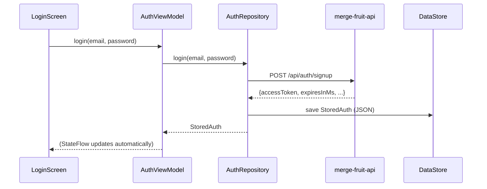

# Auth, networking & storage

## The backend hasn't changed

This app talks to the exact same `merge-fruit-api` Spring Boot backend the
web app uses — same endpoints, same request/response shapes, same error
messages. Nothing on the server was touched. If you know how the web app's
login/signup/leaderboard flow works, you already know what this app is
doing on the wire; only the client-side plumbing is different.

## Networking: Retrofit instead of `fetch`

The web app called `fetch(url, { method, headers, body })` directly inside
`authApi.ts`/`leaderboardApi.ts`. Android apps almost never call raw HTTP
APIs by hand — the standard approach is **Retrofit**, a library that turns
an *interface* into a working HTTP client:

```kotlin
interface AuthApi {
    @POST("api/auth/signup")
    suspend fun signUp(@Body body: SignUpRequest): Response<AuthResponseDto>
}
```

You never implement this — Retrofit generates the implementation at
runtime from the annotations (`@POST`, `@Body`, the URL path). It's the
closest thing Android has to the web's `fetch(url, options)`, just typed
and declarative instead of imperative. `suspend fun` means "this is an
async function" — Kotlin's coroutines are its version of `async`/`await`;
calling `authApi.login(...)` from a coroutine behaves just like
`await fetch(...)` did.

[`data/api/`](../app/src/main/java/com/a1exymoroz/mergefruit/data/api/)
holds:

- `AuthApi.kt` / `ScoresApi.kt` / `HealthApi.kt` — the Retrofit interfaces
  (≈ `authApi.ts` / `leaderboardApi.ts` / `healthApi.ts`).
- `ApiModels.kt` — the request/response data shapes (≈ the `interface`s at
  the top of those same `.ts` files).
- `ApiConfig.kt` — builds the actual Retrofit + OkHttp client once
  (base URL, JSON parsing, logging). Closest web equivalent: the shared
  `axios` instance pattern, if you've used one.
- `ColdStartRepository.kt` — pings the backend's health check and tracks
  whether it's still "waking up" (the backend runs on Render's free tier
  and sleeps after inactivity) — a direct port of `healthApi.ts` +
  `useColdStart.ts`.

**Where's the JSON parsing?** Retrofit is paired with **Moshi**, a JSON
library, via `converter-moshi`. This project uses its *reflection* mode
(`moshi-kotlin`), which means Moshi looks at your Kotlin `data class`es at
runtime and figures out how to (de)serialize them — you don't write any
manual `JSON.parse`/`JSON.stringify` equivalent, similar to how the web
app's `response.json()` "just worked" against its typed interfaces.

## Auth: `AuthRepository` instead of `AuthContext`

[`data/auth/AuthRepository.kt`](../app/src/main/java/com/a1exymoroz/mergefruit/data/auth/AuthRepository.kt)
plays the same role as the web app's `AuthContext.tsx`: it's the single
place that knows how to log in, sign up, verify an email, and log out, and
it exposes the current "who's logged in" state for the rest of the app to
read. Instead of React Context + `useState`, it exposes a `StateFlow` —
Kotlin's version of an observable value that multiple screens can watch at
once (≈ a tiny single-value Redux store, or an `EventEmitter` that always
remembers its last value).



## Storage: DataStore instead of `localStorage`

The web app kept the JWT in `localStorage` (`authStorage.ts`). Browsers
give you `localStorage` for free; Android doesn't have a built-in
"key-value string storage" the app can just reach for, so this project uses
**Jetpack DataStore** — the modern, official replacement for Android's
older `SharedPreferences` API. Conceptually it's exactly `localStorage`:
async key-value storage that survives app restarts.
[`data/auth/AuthStorage.kt`](../app/src/main/java/com/a1exymoroz/mergefruit/data/auth/AuthStorage.kt)
serializes the logged-in user's info to a JSON string (via Moshi) and
stores it under one key — same shape (`StoredAuth`) as the web's
`StoredAuth` in `authStorage.ts`, same "clear it if `expiresAt` has
passed" expiry check.

Guest mode is *not* persisted to DataStore — it's an in-memory flag on
`AuthRepository` that resets when the app process dies, mirroring the web
version's use of `sessionStorage` (cleared per-tab-session) rather than
`localStorage`.

## Leaderboard

[`data/scores/ScoresRepository.kt`](../app/src/main/java/com/a1exymoroz/mergefruit/data/scores/ScoresRepository.kt)
is a direct port of `leaderboardApi.ts`: fetch the top-10 list, submit a
score, and the same defensive handling of the backend returning either a
bare JSON array or a `{content: [...]}` paginated wrapper (the web app's
`normalizeLeaderboard` helper). `ui/leaderboard/LeaderboardViewModel.kt`
holds the loading/error/entries state the leaderboard section and the
game-over dialog both read from — equivalent to the web app's Redux
`scoresSlice.ts`.

## Where to go next

[Building & running](building-and-running.md) walks through actually
getting this onto an emulator or your phone, including pointing it at a
locally-running backend.
